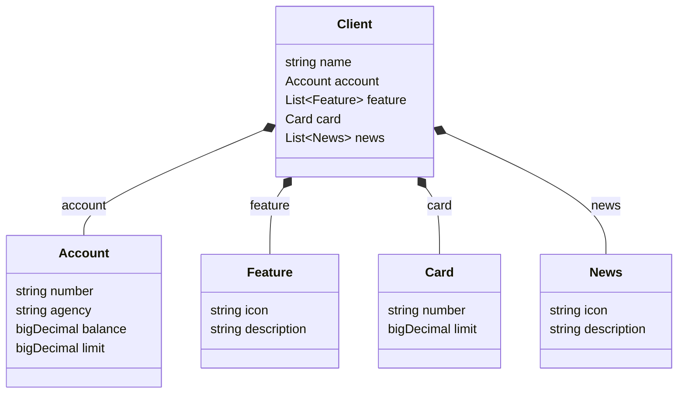

# My Bank
 Java RESTful API done in Dio Bootcamp

## Class Diagram

```mermaid
classDiagram
    class Client {
        string name
        Account account
        List~Feature~ feature
        Card card
        List~News~ news
    }

    class Account {
        string number
        string agency
        bigDecimal balance
        bigDecimal limit
    }

    class Feature {
        string icon
        string description
    }

    class Card {
        string number
        bigDecimal limit
    }

    class News {
        string icon
        string description
    }

    Client *-- Account : account
    Client *-- Feature : feature
    Client *-- Card : card
    Client *-- News : news

```

## Main Technologies
- Java 17
- Spring Boot 3
- Gradle
- Spring Data JPA
- OpenAPI (Swagger)
- Railway
